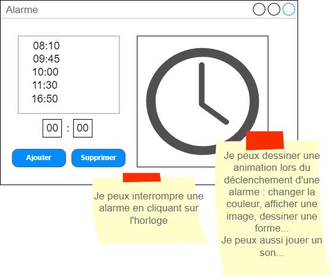

# TPIHM5 - Alarm Clock

Dans ce TP, nous allons développer une application un peu plus visuelle et interactive à l'aide des fonctionnalités graphiques de WPF, de l'utilisation d'un timer et du multi-fenêtrage.

## Travail à rendre
A la fin des deux séances (un total de 4 heures de travail), vous devrez soumettre votre projet à l'aide de travo.

## Le sujet
S'il y a bien une chose que les étudiants détestent dans la vie, c'est d'arriver en retard en cours d'IHM. Afin de pallier à ce problème, la direction de l'IUT vous demande de réaliser une application horloge permettant de configurer des alarmes.

Les fonctionnalités attendues sont les suivantes :
- Afficher une liste des alarmes actives
- Ajouter et supprimer une alarme 
- Dessiner une horloge et ses 3 aiguilles à l'aide des méthodes de dessin de WPF pour afficher l'heure en temps réel.
- Déclencher automatiquement un signal visuel (un changement de couleur) ou sonore (jouer un son) lorsque l'heure est celle d'une des alarmes de la liste.
- Interrompre l'alarme (le signal visual ou sonore) pour remettre l'application dans son état normal

Voici la maquette de ce que nous devrions avoir :



### Ajouter un Timer

Pour ajouter un Timer dans ton application, tu dois le faire depuis le code C#. Tu peux commencer par déclarer un attribut de ta classe du type "DispatcherTimer" :
```
 DispatcherTimer timer;
```

Et ensuite, dans ta méthode d'initialisation (par exemple la procédure événementielle associée à l'événement "Loaded" de la fenêtre), tu peux initialiser ton timer : 
```
timer = new DispatcherTimer();
//Définit combien de secondes entre chaque déclenchement de l'événement Tick 
timer.Interval = TimeSpan.FromSeconds(1);
//Associe une procédure événementielle à l'événement Tick du Timer, il te faut écrire cette procédure événementielle
timer.Tick += timer_Tick;
//Lance le Timer, obligatoire sinon rien ne se passe
timer.Start();
```

Dans le code de la procédure événementielle "timer_Tick", c'est ici que tu devras changer les coordonnées des aiguilles de l'horloge, et vérifier si une alarme doit se déclencher

### Le dessin de l'horloge
Pour dessiner correctement l'horloge, nous allons avoir besoin d'utiliser un peu de trigonométrie!

Tout d'abord, tu vas avoir besoin de déclarer des attributs pour chaque partie du dessin (tu pourrais ensuite le faire différemment) :
```
//Un cercle
private Ellipse ellipse;
//3 aiguilles
private Line minutes;
private Line hours;
private Line seconds;
```

En WPF, les éléments de dessin sont ajoutés dans l'interface comme des contrôles. Il nous faut donc un endroit dans l'interface où ajouter ces éléments. Dans le XAML, ajoute un contrôle de type Canvas (de préférence de taille 300x300 par exemple) qui nous servira de zone de dessin pour l'horloge. Change la propriété Name de ce Canvas en "CNVClock". Maintenant, depuis le code C#, nous pouvons y accéder.

Dans ta méthode d'initialisation (par exemple la procédure événementielle associée à l'événement "Loaded" de la fenêtre), tu peux initaliser les éléments de dessin et les ajouter à ton Canvas. Ici je ne te montre que l'initalisation du cercle et de l'aiguille des secondes (il te faudra bien sûr le faire pour les deux autres aiguilles). Le cercle ici fait la même taille que le Canvas, ça nous arrange bien:
```
ellipse = new Ellipse();
CNVClock.Children.Add(ellipse);
ellipse.Width = 300;
ellipse.Height = 300;
ellipse.Stroke = Brushes.Gray; ellipse.StrokeThickness = 1;
```
Pour les aiguilles, nous avons besoin de définir le point d'origine du trait (X1,Y1) ainsi que le point d'arrivé du trait (X2,Y2).

```
seconds = new Line();
CNVClock.Children.Add(seconds);
seconds.Stroke = Brushes.Red; seconds.StrokeThickness = 1;
//Le point d'origine est au centre du cercle
seconds.X1 = ellipse.Width / 2;
seconds.Y1 = ellipse.Height / 2;
```

Pour le point d'arrivé, nous allons avoir besoin d'un peu de trigonométrie!!
Pour cela nous allons utiliser les fonctions mathématiques de C#, notamment "Math.PI" (qui donne la valeur de π) et "Math.Cos" et "Math.Sin" qui calcule le cosinus et le sinus d’un angle donné en radians.

La méthode consiste à calculer les coordonnés "x" et "y" de ce point d’arrivée en fonction de l’angle que devrait avoir l’aiguille. Le "x" correspond au cosinus de l’angle exprimé en radians, le "y" correspond au sinus de l’angle exprimé en radians.
Il nous faut donc l’angle en radians !
Si je devais transposer le cercle de mon horloge au cercle trigonométrique j’aurais :
- Lorsque l’aiguille pointe sur 3h, alors l’angle vaut 0 radian
- Lorsque l’aiguille pointe sur le 12h, alors l’angle vaut π/2 radians
- Lorsque l’aiguille pointe sur le 9h, alors l’angle vaut π radians
- Lorsque l’aiguille des secondes pointe sur n secondes, alors l’angle vaut π/2-(n * π/30) radians
- etc…

Je te donne le code pour l'aiguille des secondes. En même temps que tu le copie-colles au bon endroit, essaye de le comprendre. Tu devras également le faire pour les minutes et les heures. Attention, les valeurs dans l'équation trigonométrique pourront être différentes pour les autres aiguilles. 

Comme je te le disais plus haut, lorsque l’aiguille des secondes pointe sur n secondes, alors l’angle ne vaut pas juste n * π/30 mais π/2-(n * π/30) radians (c'est parce que l'origine du cercle est à droite et que le sens de rotation est inverse par rapport au sens des aiguilles). N'hésite pas à faire un dessin pour comprendre.

```
//Je définis la longueur de l'aiguille, je pourrais mettre une autre valeur
double longueurAiguilleSeconde = ellipse.Width/2; 
seconds.X2 = ellipse.Width / 2 + Math.Cos(15 * Math.PI / 30 - DateTime.Now.Second * Math.PI / 30) * longueurAiguilleSeconde;
seconds.Y2 = ellipse.Height / 2 + Math.Sin(-15 * Math.PI / 30 + DateTime.Now.Second * Math.PI / 30) * longueurAiguilleSeconde;
```
